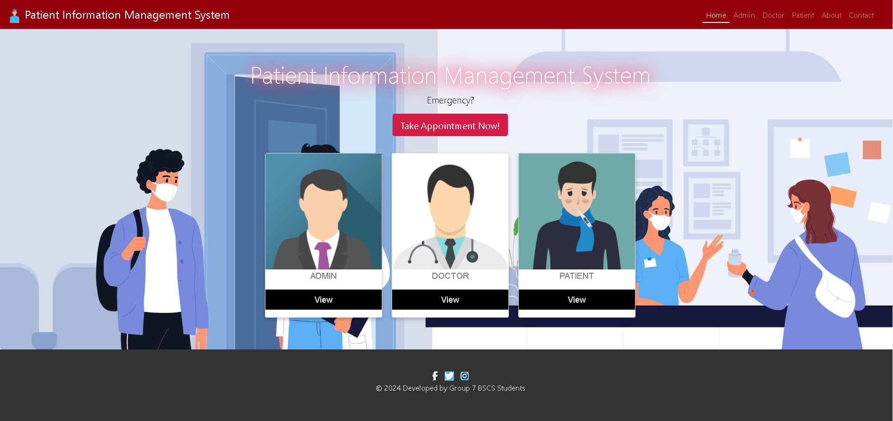
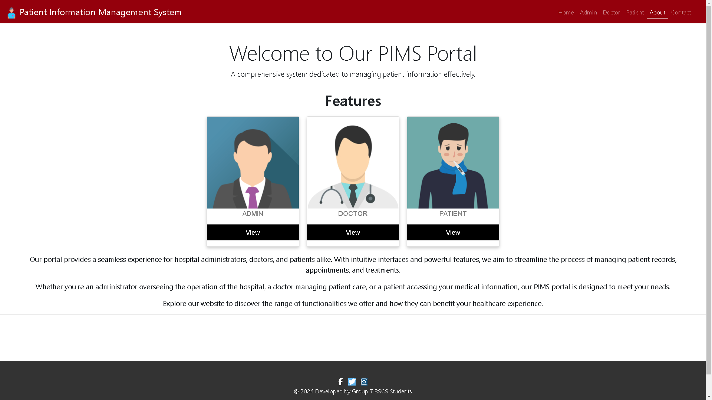
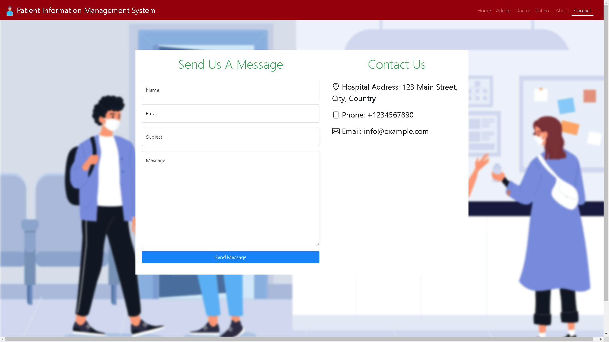
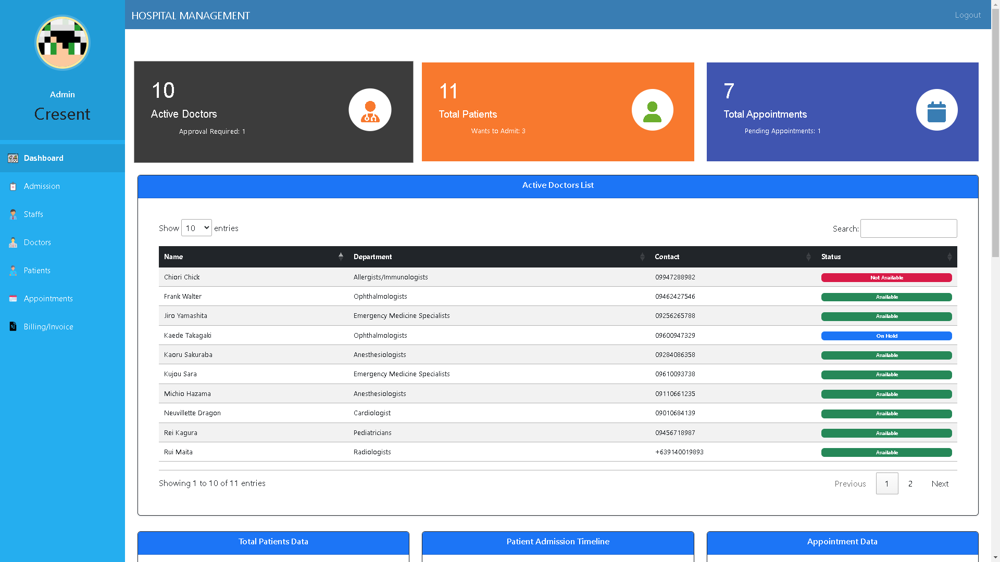
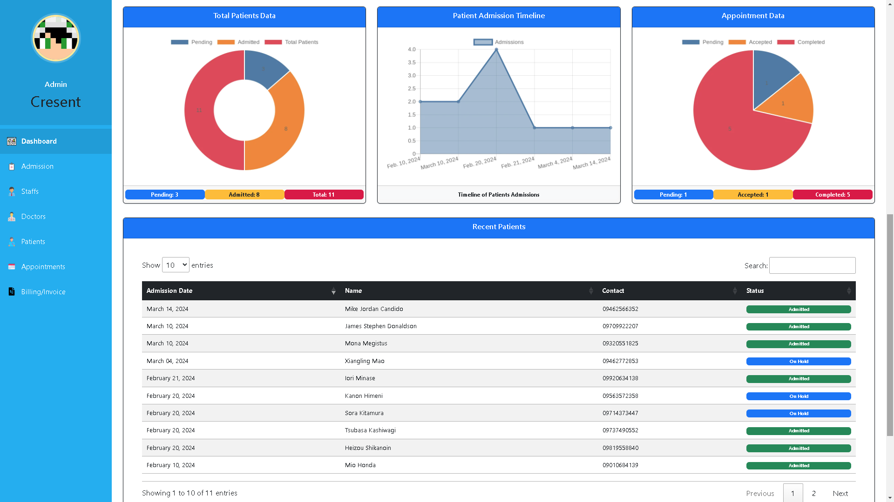
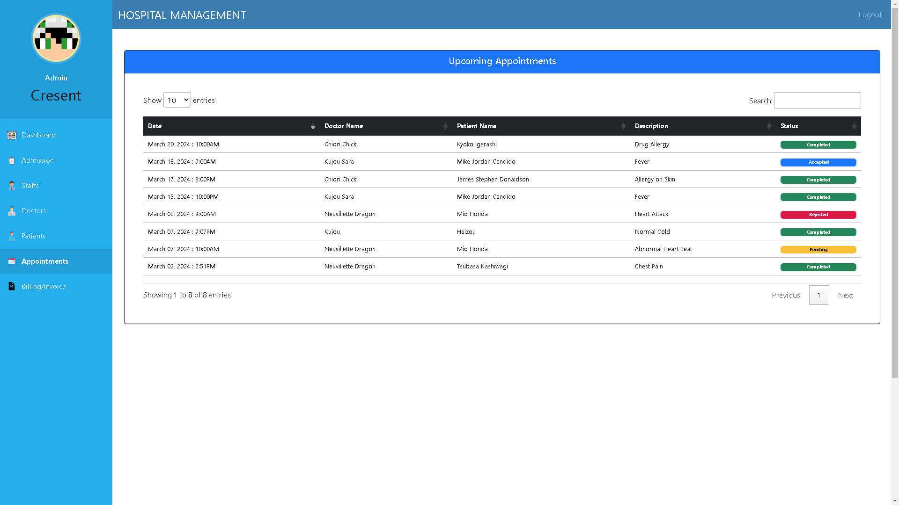
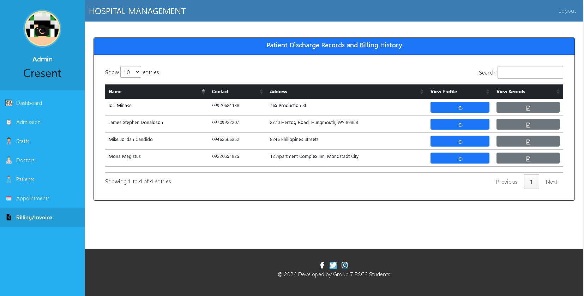

# Patient Information Management System (PIMS)

Welcome to the Patient Information Management System (PIMS). This project efficiently manages patient information within healthcare settings. Developed on Django and utilizing SQLite, PIMS offers a robust solution for healthcare data management.

**Note**: This project is an adapted version, all credits belong to the original developer, Sumit Kumar. It is used solely for educational purposes.

## Features Added:
### Added, Changes, and Fixes:
- **Added New Charts on Admin Dashboard**
- **Admin, Doctor, Patient Dashboard Overhaul**
- **Floating Forms with Toggleable Passwords**
- **Admin can view Doctor, Patients Records**
- **Admission for Already Registered Patients**
- **Bills Management and View History of Invoices of Patients**
- **Email Notification System**
- **In Discharge Patient:** After marking the bill of the patient as paid, their account will be deactivated and ready for readmission in the future, eliminating the need for patients to register again.
- **Receptionist User:** Introduced a Receptionist user subgroup within the Admin group, providing restricted access without is_superuser permissions and limitations on accessing the Staff Panel or viewing and updating staffs.
- **Improved Contact Us Form:** Enhanced the Contact Us form for better communication and user interaction.

### User Experience Enhancements:
- **Strong Passwords & View Toggle Password for All Users:** Implemented strong password functionality with the ability to toggle password visibility.
- **Session Timeouts:** Automatically logs out users after a certain period of inactivity or when the browser is closed.
- **Avatar Menu Update:** Users can easily change their profile pictures with a few clicks.
- **Staff Admin Validation/Approval:** Only SuperUsers can see and approve new user registrations.
- **Doctor Status Toggle:** Doctors can conveniently update their availability status for appointments.
- **Bootstrap 5 Integration:** Upgraded to Bootstrap 5 for enhanced design and functionality.
- **Appointment Scheduling:** Allows scheduling appointments for Admins, Doctors, and Patients (pending approval).
- **Authentication:** Implemented authentication for Staff, Doctors, and Patients.
- **Updated Staff Dashboard:** Staff/Admin can manage profiles, update, or delete doctor and patient information.
- **Doctor Appointment Management:** Doctors can schedule appointments for patients within their department.
- **Doctor Approval System:** Doctors can accept/reject appointment requests from patients.
- **Patient Appointment Booking:** Patients can request appointments, pending approval from assigned doctors or staff members.
- **Doctor Appointment Status Update:** Doctors can mark patients' appointments as "COMPLETED."
- **About Us Section:** Added a new page providing information about the hospital.

### Bug Fixes and Improvements:
- **Upgrade to Bootstrap 5:** Replaced Bootstrap 3 with Bootstrap 5, resolving CSS conflicts.
- **User Interface Adjustments:** Optimized for mobile and tablet devices.
- **Enhanced User Experience:** Made cards clickable for improved usability.
- **Integration of Static Icons:** Replaced deprecated icon links with static icons.
- **SweetAlerts2 Integration:** Improved user interaction with SweetAlerts on CRUD operations.
- **Logout Redirections Update:** Users are now redirected to their corresponding login pages instead of the index.html.

## Planning/ Implementation:
- Password Reset Functionality
- Email Verification (6-digit code)
- Planning to change Schema DB for HospitalStaff and Doctor to have Shift Time (Schedules)
- User Setting Profile (Updating their own)
- Prescription System For Doctors & Patients (2025)
- Pharmacy Management System (2025)
- Chat Rooms

# Screenshots

## Homepage


## About Us


## Contact


## Admin User
### Admin Dashboard1


### Admin Dashboard2


### Appointments


### Billing Invoice History Records


### Invoice


## Receptionist
### Receptionist Dashboard


### Receptionist Payment Management


## Doctor
### Doctor Dashboard


### Doctor Discharge Records


## Patient
### Patient Dashboard


### Patient Insurance


### Patient Invoice


## Requirements and Installation Instructions:

### 1. Python Installation:

#### For Windows:
1. Download the latest Python installer for Windows from [python.org](https://www.python.org/downloads/).
2. Ensure to check "Add Python to PATH" during installation.
3. Verify the installation by opening a Command Prompt and running:
    ```bash
    python --version
    ```

#### For macOS:
1. Check if Python is installed by running:
    ```bash
    python3 --version
    ```
    If not, install using [Homebrew](https://brew.sh/):
    ```bash
    brew install python
    ```

#### For Linux (Ubuntu/Debian):
1. Open a terminal and run:
    ```bash
    sudo apt-get update
    sudo apt-get install python3
    ```
2. Verify the installation:
    ```bash
    python3 --version
    ```

### 2. Checking Python in PATH:
Ensure Python is added to the system PATH. Open a new terminal/command prompt window and run:
```bash
python --version
```
If it returns the Python version, you're set. If not, update your system PATH.

### 3. SQLite Installation:
SQLite comes bundled with Python; no separate installation is usually needed.

### 4. SQLiteStudio:
Use [SQLiteStudio](https://sqlitestudio.pl/) as a GUI tool for managing SQLite databases. Download and install it according to your operating system.

---

With these tools installed and Python in your system PATH, proceed with setting up the Patient Information Management System as described in the previous README section.

**Note**: Ensure administrative privileges for installing Python and modifying the system PATH.

## Generating SECRET_KEY and Email Credentials for this Django Project

In order to run the Patient Information Management System (PIMS), you'll need to generate a `SECRET_KEY` for your Django project. This key is used for cryptographic signing and should be kept secret. Additionally, you'll need to configure email credentials for email functionality within the application.

### Generating SECRET_KEY:

To generate a `SECRET_KEY`, follow these steps:

1. Open a Python shell or terminal.
2. Run the following command to generate a random `SECRET_KEY`:

    ```bash
    python -c "from django.core.management.utils import get_random_secret_key; print(get_random_secret_key())"
    ```

3. Copy the generated key.

### Configuring Email Credentials:

For email functionality within the PIMS project, you need to configure the following email credentials:

- `EMAIL_HOST_USER`: Your email address used for sending emails.
- `EMAIL_HOST_PASSWORD`: The password for the email account.
- `EMAIL_RECEIVING_USER`: Email address where you will receive messages sent from the website.
- `DEFAULT_FROM_EMAIL`: The default email address used as the sender.

Follow these steps to configure email credentials:

4. Create a file named `.env` in the root directory of your project, next to the `settings.py` file (in the `hospitalmanagement` folder in this case).

5. Add the following lines to the `.env` file, replacing `<generated_secret_key>` with the actual `SECRET_KEY` you copied earlier, and filling in the email credentials:

    ```plaintext
    SECRET_KEY=<generated_secret_key>

    # Email Backend
    EMAIL_HOST_USER=your_email_address
    EMAIL_HOST_PASSWORD=your_email_password
    EMAIL_RECEIVING_USER=your_receiving_email_address
    DEFAULT_FROM_EMAIL=your_default_email_address
    ```

6. Save the `.env` file.

Now, your Django project will use the secret key and email credentials specified in the `.env` file. Remember not to share or expose these sensitive credentials publicly.

For more information on setting up and running the PIMS project, refer to the "Setting Up and Running the Local Server" section in the README.


## Setting Up and Running the Local Server:

1. Set up a virtual environment:
    ```bash
    python -m venv venv
    ```

2. Set the execution policy for the current PowerShell session to RemoteSigned:
    ```bash
    Set-ExecutionPolicy RemoteSigned -Scope Process
    ```

3. Activate the virtual environment:
    ```bash
    venv/Scripts/activate
    ```

4. Install dependencies, apply migrations, and run the local server:
    ```bash
    pip install -r requirements.txt
    python manage.py makemigrations
    python manage.py migrate
    python manage.py runserver
    ```

### Superuser Access to Django Database:
To create a superuser and access the Django admin site:
```bash
python manage.py createsuperuser
```

**Note**: Original Project: [Hospital Management System Django](https://github.com/sumitkumar1503/hospitalmanagement) by Sumit Kumar. This project uses Python with the Django Web Framework, SQLite as the database, and is developed as a web application.
